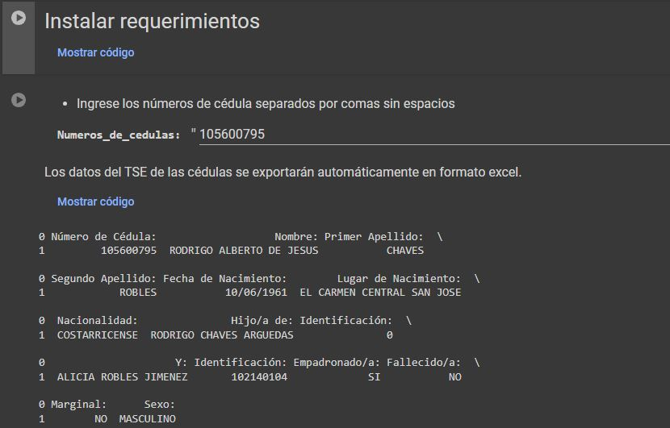
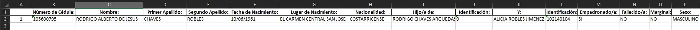

# Obtener datos del TSE por cédulas, código en python.
Extrae los datos del TSE de todas las cédulas que sean ingresadas, estos datos serán mostrados en Google Colab y automaticamente descargará una base de datos en formato Excel.

## Vista previa

## Instrucciones
1. Abrir el enlace de Google Colab.
2. Se abrirá el archivo `Obtener_datos_del_TSE_por_cedulas.ipynb` desde GitHub.
3. Ingresar las cédulas (separadas por una coma).
4. Ir a `Entorno de ejecución` -> `Ejecutar todas`.
5. Esperar a que carguen los datos.
6. Guardar en una carpeta la base de datos en Excel.

## Uso
La casilla de requerimientos solo será necesario que se complete con éxito una vez.
El uso de espacios entre comas dará error las cédulas deben ir de la forma XXXXXXXXX,XXXXXXXXX,XXXXXXXXX,...

Dirección de acceso al código: https://colab.research.google.com/github/juanandres-montero/DataAnalysis/blob/main/Obtener_datos_del_TSE_por_cedulas.ipynb 

Contacto: juanandres-montero@outlook.com
